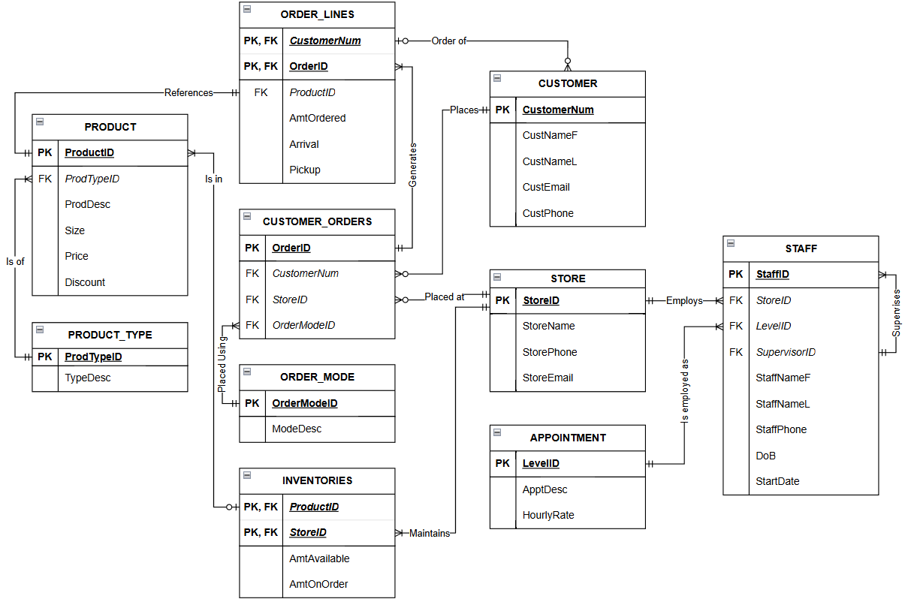

# Designing a Database

## Overview

This project designs and implements a relational database for a fictional fashion retailer. It includes schema creation, sample data insertion, and example SQL queries for reporting on customers, staff, stores, products, inventory, and orders.

## My Contribution

For this project, I:

- Created the entity relationship diagram (ERD)
- Normalised the schema and produced relational schema diagrams
- Wrote the sample data insertion scripts
- Assisted with the table creation and query scripts

## Key Features

- Normalised relational schema
- Primary and foreign key relationships
- Many-to-many relationship handling through order lines and inventory
- Sample data for testing
- Reporting queries using joins, sorting, and filtering

## Tech Stack

- SQL
- MySQL
- Relational database design
- Entity relationship modelling
- Schema normalisation

## How to Run

1. Create a new MySQL database
2. Run `create.sql`
3. Run `insert.sql`
4. Run `query.sql`

## Database Entities

The entities modeled in this database are:

- CUSTOMER
- STORE
- STAFF
- APPOINTMENT
- PRODUCTTYPE
- PRODUCT
- INVENTORY
- ORDERMODE
- CUSTOMERORDER
- ORDERLINE

## Schema Summary

- `STAFF` belongs to an `APPOINTMENT`
- `STAFF` belongs to a `STORE`
- `STORE` references a `StoreManagerID` in `STAFF`
- `PRODUCT` belongs to a `PRODUCTTYPE`
- `INVENTORY` links `PRODUCT` and `STORE`
- `CUSTOMERORDER` links `CUSTOMER`, `STORE`, and `ORDERMODE`
- `ORDERLINE` links `CUSTOMERORDER` and `PRODUCT`

## Entity Relationship Diagram

## Query Examples

The following questions can be answered by querying the database:

1. What is each staff members hourly salary?
2. What is the second oldest order date, and which customer placed that order?
3. Which staff members are store managers, which stores do they manage, and what are their hourly salaries?
4. Which products have been picked up, how many units have been sold, and what are their details?
5. Which products were picked up after a given date?

## Limitations / Improvements

- Sample dataset is small and intended for demonstration purposes only
- Naming conventions could be more consistent

## More Projects

More projects are available in my [portfolio repository](https://github.com/JohnMartinMacLeod/data-portfolio)